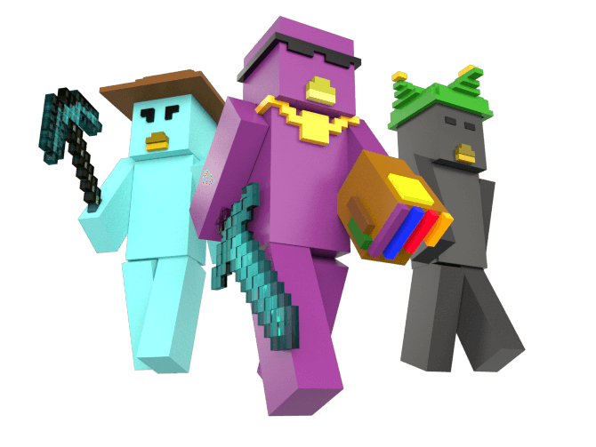

<div align="center">
  
  <h3>Moonsama Minecraft Gain Calculator</h3>
</div>

---

### Table of contents

- [Run the develoment server](#-Run-the-develoment-server)
- [Contribute](#-Develop)
- [Deployment](#-Deploy)

---

### 💻 Run the develoment server

You will need [nodeJS](https://nodejs.org/en/) installed on your machine, then run:

```shell
npm install
npm start
```

---

### 👨🏻‍💻 Develop

##### Coding style

Use the coding style recommended by [codeguide.co](https://codeguide.co).

##### Structure

- HTML files are located in `/src/`. `.njk` files are templates ([Nunjucks](https://mozilla.github.io/nunjucks/)) files.

- CSS files are located in `/src/css/`.

- TypeScript files are located in `/src/ts/`. The files are concatenated in alphabetical order unless specified otherwise.


Hit `ctrl + C` to stop the server.

---

### 🚀 Deploy

Run `npm run build`. The `/dist/` folder contains the production website.

